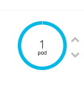

# Práctica 2: Desplegando una página estática en OpenShift

Vamos a desplegar len OpenShift la página estática que se encuentra en el repositorio al que le has hecho un fork. Para ello:

1. Accede a la consola web de OpenShift (usuario *developer* y con cualquier contraseña) y elige del catalogo de imágenes, la plantilla **Apache HTTP Server**.

2. A continuación indicamos el nombre de nuestra aplicación y el repositorio que queremos desplegar (la dirección del repositorio será con https, para que openshift pueda acceder al mismo).

3. Accede a tu proyecto y a la aplicación y comprueba que se está ejecutando el primer *build* (en este proceso se crea una imagen docker a partir de la imagen que hemos seleccionado (apache2) y el contenido del repositorio indicado. A partir de esta imagen se creará posteriormente el *deploymente* que creara el *pod* de nuestra aplicación).

4. Una vez terminada la ejecución del *build*, comprueba que se ha creado un *deployment*, un *pod*, un *service* y una *ruta de acceso* a la aplicación.

5. Accede desde un navegador a la ruta de acceso de la aplicación y comprueba que hemos desplegado nuestra aplicación.

## Escalando nuestra aplicación

6. Vamos a escalar nuestra aplicación, por lo tanto vamos a crear más pods con nuestra aplicación. Para ello simplemente localiza el gráfico donde vemos el círculo donde vemos el pod y pulsa sobre la flecha superior.

7. Comprueba que se han creado varios pods. Accede a la aplicación desde el navegador, aunque no lo podamos vver, el acceso a la aplicación se está repartiendo entre los distintos pods que se están ejecutando en los diferentes nodos del cluster (balanceo de carga).

## Actualización de nuestra aplicación

8. En nuetro ordenado vamos a cambiar el fichero `index.html` de nuestro repositorio, posteriormente subimos los cambios a nuestro repositorio remoto en GitHub:

        git commit -am "Hemos cambiado el fichero index"
        git push

9. A continuación, desde la consola web de OpenShift, ejecuta un nuevo *build*. Una vez terminado comprueba que se ha creado un nuevo *deployment* y que se han parado los pods danteriores y se han creado nuevos con la nueva versión de la aplicación.

10. Accede a la aplicación desde un navegador web y comprueba que se ha modificado.

## Rollout de nuestra aplicación

11. En cualquier momento, podemos volver a la versión de nuestra aplicación de un *deployment* anterior. Para ello sólo debes acceder al número de *deployment* que quieres recuperar y pulsar sobre el botón **Roll Back**. En este momento se creará un nuevo *deployment* que creará nuevos pods con la versión anterior de la aplicación.

12. Comprueba efectivamente que la aplicación se ha modificado a la versión original.