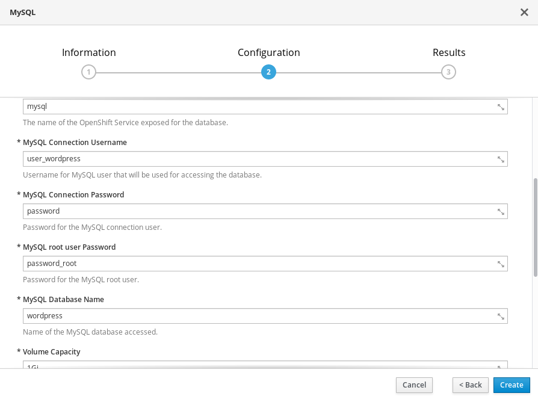
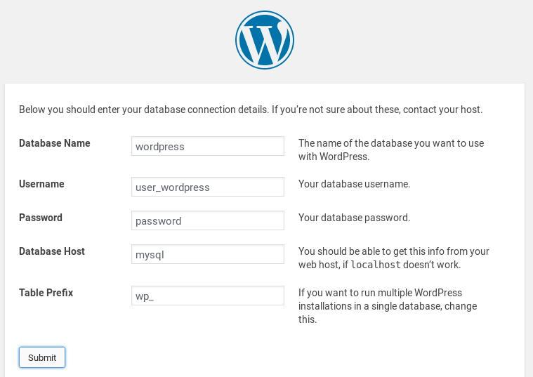

# Práctica 3: Desplegando una aplicación php

## php + sqlite

Vamos a instalar un CMS PHP que utiliza una base de datos Sqlite. ( [phpSQLiteCMS](https://github.com/ilosuna/phpsqlitecms)).

1. Accede a la consola web de OpenShift y elige del catalogo de imágenes, la imagen **PHP**.

2. Indica el nombre de la aplicación, escogemos la versión de PHP e indicamos el repositorio de la aplicación.

3. Comprueba los recursos que se han creado (build, imágen, deployment, pod, servicios, ruta, ...)

4. Accede a la ruta de acceso y comprueba que la aplicación está funcionando.

## php + mysql

En este caso vamos a desplegar un cms Wordpress utilizando una base de datos mysql.

1. Lo primero que vamos a hacer es crear un despliegue con una base de datos mysql. Para ello escogemos del catalogo una imagen **mysql**.

2. Indicamos los siguiente datos:

    * Nombre y contraseña del usuario de la base de datos
    * Nombre de la base de datos

    

3. Comprobamos que tenemos un pod que esta ejecutando mysql. ¿Se ha creado una ruta de acceso? ¿Por qué?

4. A continuación vamos a desplegar Wordpress, para ello vamos a crear otra aplicación escogiendo del catálogo la imagen **php** e indicando el nombre de la aplicación y el repositorio GitHub de Wordpress.

5. Comprobamos que se ha creado el *deployment* y el *pod* de forma adecuada, accedemos a la ruta de acceso de la aplicación y comenzamos el proceso de instalación de Wordpress.

6. En la pantalla de configuración de la base de datos durante la instalación de wordpress indicamos los datos que habíamos definido en la creación de la aplicación mysql:

    

7. Comprueba que la instalación se ha llevado a cabo y que la aplicación está funcionando de forma adecuada. 
